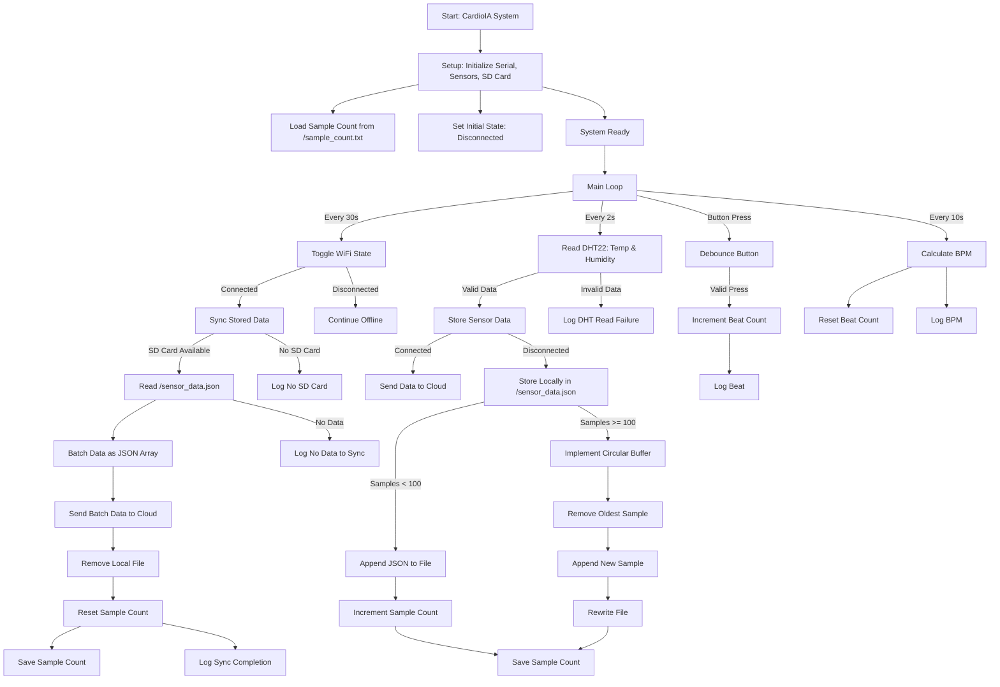

# Relatório - PARTE 1: Armazenamento e Processamento Local (Edge Computing)

## Resumo Executivo

Este relatório descreve a implementação de um sistema de monitoramento cardíaco baseado em Edge Computing, utilizando ESP32 com sensores DHT22 e botão para simulação de batimentos cardíacos. O sistema implementa resiliência offline, armazenamento local via SD Card e sincronização automática de dados quando a conectividade é restabelecida.

## Arquitetura do Sistema

### Componentes Principais

1. **ESP32 DevKit C v4**: Microcontrolador principal
2. **DHT22**: Sensor de temperatura e umidade (pino 15)
3. **Botão**: Simulação de batimentos cardíacos (pino 32)
4. **SD Card**: Armazenamento local (CS=5, MOSI=23, MISO=19, SCK=18)
5. **ArduinoJson**: Biblioteca para serialização de dados

### Fluxo de Funcionamento



## Implementação de Resiliência Offline

### Estratégia de Armazenamento Limitado

O sistema implementa uma estratégia de **buffer circular** com as seguintes características:

- **Capacidade máxima**: 100 amostras
- **Formato de dados**: JSON com timestamp, temperatura, umidade, frequência cardíaca e status WiFi
- **Política de substituição**: FIFO (First In, First Out)

### Lógica de Resiliência

1. **Modo Offline**:
   - Dados são sempre armazenados localmente no SD Card
   - Sistema continua coletando dados independente da conectividade
   - Implementa buffer circular quando limite é atingido

2. **Modo Online**:
   - Dados são enviados imediatamente para a nuvem
   - Dados armazenados são sincronizados automaticamente
   - Arquivo local é limpo após sincronização bem-sucedida

### Simulação de Conectividade

```cpp
// WiFi simulation
bool isConnected = false;
unsigned long lastWifiToggle = 0;
const unsigned long wifiToggleInterval = 30000; // Toggle every 30s
```

O sistema simula mudanças de conectividade a cada 30 segundos para demonstrar o comportamento offline/online.

## Estrutura de Dados

### Formato JSON Armazenado

```json
{
  "timestamp": 12345678,
  "temperature": 36.5,
  "humidity": 45.2,
  "heartRate": 72,
  "wifiStatus": "disconnected"
}
```

### Arquivos SD Card

- `/sensor_data.json`: Dados dos sensores (formato JSON, uma linha por amostra)
- `/sample_count.txt`: Contador de amostras armazenadas

## Funcionalidades Implementadas

### Leitura de Sensores
- **DHT22**: Temperatura e umidade a cada 2 segundos
- **Botão**: Simulação de batimentos cardíacos com debounce
- **Cálculo de BPM**: Baseado em contagem de batimentos por intervalo

### Armazenamento Local (SD Card)
- Serialização de dados em JSON
- Persistência em arquivo local
- Controle de capacidade máxima
- Implementação de buffer circular

### Resiliência Offline
- Coleta contínua independente da conectividade
- Estratégia de armazenamento limitado (100 amostras)
- Preservação de dados durante desconexões

### Sincronização Automática
- Detecção automática de reconexão
- Envio de dados armazenados para a nuvem
- Limpeza do armazenamento local após sincronização

## Estratégia de Armazenamento Limitado

### Justificativa da Capacidade (100 Amostras)

Considerando:
- **Frequência de coleta**: 1 amostra a cada 2 segundos
- **Capacidade de armazenamento**: ~1MB disponível no SD Card
- **Tamanho por amostra**: ~100 bytes (JSON)
- **Duração offline**: ~3.3 minutos de dados (100 × 2s = 200s)

Esta estratégia garante que o sistema possa operar offline por períodos curtos sem perder dados críticos, adequado para aplicações de monitoramento de saúde onde a latência de dados é importante.

### Implementação do Buffer Circular

```cpp
void implementCircularBuffer(String newData) {
  // Lê conteúdo atual do arquivo
  // Remove a primeira linha (amostra mais antiga)
  // Adiciona nova entrada ao final
  // Regrava o arquivo com as linhas rotacionadas
  // Mantém capacidade fixa (100 amostras)
}
```

## Benefícios do Edge Computing

1. **Resiliência**: Sistema continua funcionando sem conectividade
2. **Eficiência**: Reduz tráfego de rede e latência
3. **Confiabilidade**: Dados não são perdidos durante desconexões
4. **Escalabilidade**: Processamento local reduz carga na nuvem

## Monitoramento e Logs

O sistema fornece logs detalhados via Serial Monitor:

- Inicialização do SD Card
- Status de conectividade WiFi
- Confirmação de armazenamento local
- Sincronização de dados
- Alertas de capacidade de armazenamento

### Exemplos de Logs

```
🚀 CardioIA System Starting...
✅ SD Card Ready
📡 WiFi: DISCONNECTED
✅ System Ready - DHT: 2s, BPM: 10s, WiFi: 30s
🌡️ Measured: 25.3°C 45.2% BPM:72
❤️ Beat: 1 (2s)
💾 Stored locally (1/100)
📡 WiFi: CONNECTED
🔄 Syncing 5 samples...
📤 Batch syncing 5 samples...
✅ Synced 5 samples - local storage cleared
```

## Conclusão

A implementação demonstra com sucesso os princípios do Edge Computing aplicados à saúde digital:

- **Processamento local** de dados críticos
- **Resiliência offline** para aplicações médicas
- **Sincronização inteligente** quando conectividade é restabelecida
- **Estratégia de armazenamento** balanceada entre capacidade e performance

O sistema está preparado para integração com protocolos de comunicação (MQTT) e dashboards de visualização (Node-RED) na próxima fase do projeto.

---

**Desenvolvido por**: Gustavo Castro (RM560831), Luis Emidio (RM559976), Ricardo Oliveira (RM561182)
**Data**: Outubro 2024  
**Tecnologias**: ESP32, SD Card, ArduinoJson, Edge Computing
