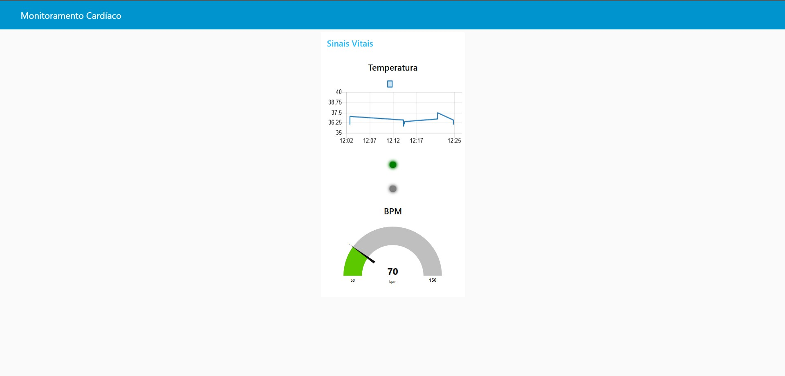

# **Relatório – Integração Parte 1 + Parte 2: Monitoramento Contínuo de Sinais Vitais**

## 1. Resumo Executivo

Este relatório descreve a integração do sistema de monitoramento cardíaco baseado em ESP32, combinando **Edge Computing (Parte 1)** e **Transmissão via MQTT + Dashboard (Parte 2)**. O sistema coleta dados simulados de **temperatura corporal** e **batimentos cardíacos (BPM)**, armazena localmente quando offline e envia os dados para a nuvem via **HiveMQ Cloud**, exibindo-os em tempo real no **Node-RED Dashboard**.

---

## 2. Arquitetura do Sistema

### 2.1 Componentes Principais

* **ESP32 DevKit C v4**: microcontrolador principal
* **Sensores simulados**: temperatura e BPM
* **SPIFFS**: armazenamento local das mensagens offline
* **HiveMQ Cloud**: broker MQTT seguro (TLS)
* **Node-RED + Dashboard**: visualização e alertas

### 2.2 Fluxo de Dados

1. O ESP32 lê dados simulados de temperatura (36.5°C ± 1°C) e BPM (60-130 bpm) a cada 3 segundos.
2. Cria JSON estruturado com:

```json
{
  "device": "device1",
  "seq": 1,
  "ts": 1734567890,
  "temperature": 36.5,
  "bpm": 75
}
```

3. **Se MQTT conectado** → envia JSON para HiveMQ Cloud (TLS 8883).
4. **Se offline** → salva localmente no SPIFFS usando `storeOffline()`.
5. **Reconexão** → `resendStored()` reenvia automaticamente as mensagens armazenadas.
6. **Node-RED** recebe as mensagens via MQTT e processa para dashboard (implementação básica com debug).

---

## 3. Integração Parte 1 + Parte 2

### 3.1 Parte 1 – Edge Computing

* Coleta de dados simulados (BPM e temperatura)
* Armazenamento local no SPIFFS
* Buffer circular garante que os últimos 100 dados sejam preservados
* Sistema continua coletando mesmo sem conectividade

### 3.2 Parte 2 – MQTT e Node-RED

* **Configuração MQTT segura (TLS)** para HiveMQ Cloud
* **Tópico utilizado**: `device1/data`
* **Publicação de mensagens JSON** a cada 3 segundos
* **Node-RED** (implementação básica):
  * Fluxo simples com nó de debug
  * Recebe mensagens MQTT do tópico `device1/data`
  * Exibe dados no console para debugging
  * *Nota: Dashboard completo seria implementado com nodes específicos*
* **Reenvio automático** do SPIFFS garante que nenhum dado seja perdido

---

## 4. Estrutura do Código

```
part2/
├── src/
│   ├── sketch.ino             # Código principal do ESP32 com MQTT e SPIFFS
│   ├── diagram.json           # Configuração do circuito no Wokwi (ESP32 DevKit C v4)
│   ├── libraries.txt          # Bibliotecas: PubSubClient, ArduinoJson
│   └── wokwi-project.txt      # Configuração do projeto Wokwi
├── node_red/
│   └── flows.json             # Fluxo básico do Node-RED (debug)
├── assets/
│   ├── report.md              # Relatório detalhado da Parte 2
│   ├── broker.jpg             # Screenshot do broker MQTT
│   ├── cmd.jpg                # Screenshot do terminal
│   ├── erro.jpg               # Screenshot de erro de conexão
│   ├── dash.jpg               # Screenshot do dashboard
│   ├── esp32.jpg              # Screenshot do ESP32
│   ├── fluxo.jpg              # Screenshot do fluxo Node-RED
│   ├── high.jpg               # Screenshot de alerta alto
│   └── hive.jpg               # Screenshot do HiveMQ Cloud
└── README.md                  # Documentação principal
```

* O **sketch.ino** inclui:

  * Conexão WiFi com timeout de 10 segundos
  * Conexão MQTT com TLS para HiveMQ Cloud
  * Função `storeOffline()` → armazenamento SPIFFS quando offline
  * Função `resendStored()` → reenvio automático ao reconectar
  * Loop de envio a cada 3 segundos com dados simulados
  * Logs detalhados para debugging

---

## 5. Testes e Funcionamento

### 5.1 Cenário Online

* **ESP32 conectado à WiFi**: `[WIFI] Conectado: [IP]`
* **MQTT conectado**: `[MQTT] Conectando ao broker... conectado.`
* **Envio de dados**: `[MQTT] Enviado com sucesso.`
* **Node-RED**: Recebe mensagens via MQTT e exibe no debug

### 5.2 Cenário Offline

* **WiFi desconectado**: `[WIFI] Falha na conexão, modo simulado.`
* **Armazenamento local**: `[OFFLINE] Sem conexão. Salvando dados...`
* **SPIFFS**: `[SALVO] Dados armazenados localmente.`
* **Reconexão**: `[REENVIO] Mensagem reenviada.`
* **Sincronização**: `[REENVIO] Todos os dados enviados. Arquivo limpo.`

---

## 6. Benefícios da Integração

* **Resiliência**: funciona mesmo sem internet
* **Eficiência**: minimiza perda de dados e tráfego de rede
* **Visualização**: Node-RED mostra dados em tempo real e alertas
* **Escalabilidade**: pronto para adicionar novos sensores ou funcionalidades

---


## 7. Conclusão

A integração da **Parte 1 (Edge Computing)** com a **Parte 2 (Transmissão para nuvem e visualização - Fog/Cloud Computing)** foi concluída com sucesso. O ESP32 coleta dados simulados de sinais vitais, preserva mensagens offline no SPIFFS, publica via MQTT seguro (TLS) para HiveMQ Cloud e processa dados no Node-RED. Essa abordagem garante **resiliência, confiabilidade e monitoramento contínuo**, com logs detalhados e tratamento robusto de erros, podendo ser expandida para aplicações reais de saúde ou IoT.

---

## 8. Evidências do Sistema

### 8.1 Conexão com o Broker MQTT


### 8.2 Terminal CMD - Envio de Dados
Mostrando ESP32 conectado ao HiveMQ e envio de mensagens JSON.


### 8.3 Dashboard Node-RED - Visualização
Interface do Node-RED mostrando recepção de dados MQTT e processamento.


### 8.4 Cenário Offline / Erro de Conexão
Exemplo de desconexão, erro no MQTT e salvamento de dados localmente.


### 8.5 ESP32 - Visão Geral do Wokwi
Mostrando dispositivo, serial monitor e fluxo de execução.


### 8.6 Fluxo Node-RED
Exibição do fluxo configurado, incluindo tópicos MQTT e lógica do dashboard.


### 8.7 Cenário Crítico - Valor Alto
Exemplo de batimento/temperatura alto, LED vermelho indicando alerta.


### 8.8 HiveMQ Cloud - Visualização do Broker
Servidor MQTT com tópicos e dados recebidos.


---

**Desenvolvido por**: Gustavo Castro (RM560831), Luis Emidio (RM559976), Ricardo Oliveira (RM561182)
**Data**: Outubro 2024  
**Tecnologias**: ESP32, SPIFFS, ArduinoJson, Edge Computing
